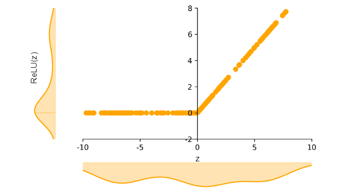
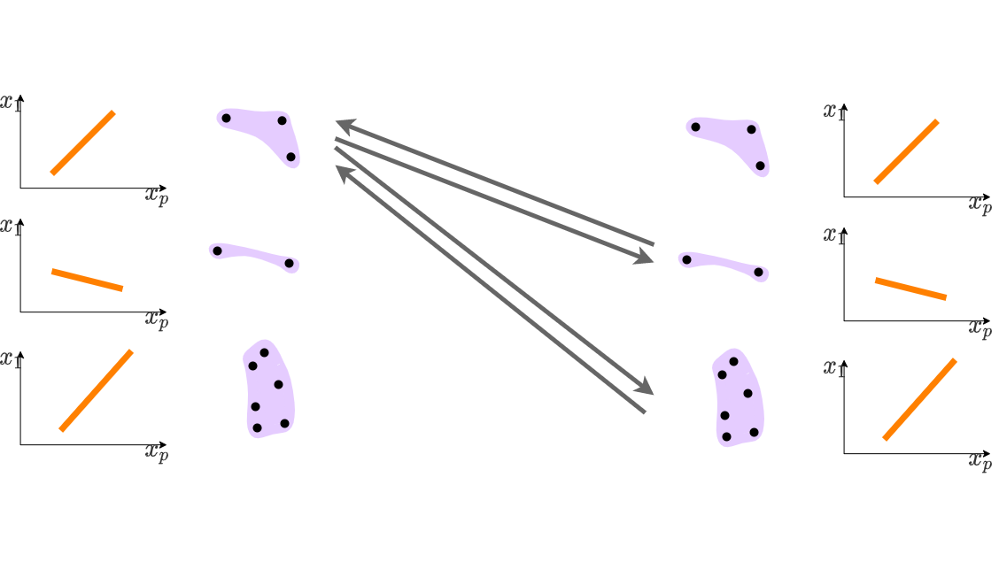

# Mixture of Linear Models(MLM)   Co-supervised by Deep Neural Network
<h4 class="author">Beomseok Seo</h4>
<h4 class="date">2022-05-01</h4>

MLM explains DNN by approximating it with a piecewise linear model.
<a href="https://arxiv.org/abs/2108.04035">Arxiv preprint can be obtained here.</a>
(accepted by Journal of Computational and Graphical Statistics on 4/6/2022)

---

---

<h1 class="title toc-ignore">Overview</h1>

One natural idea of explaining a complex function is to view the function as a composite of multiple simple functions in different segments of input space.
 &rarr; How to find the segments?
 &rarr; Using DNN as a proxy of the optimal prediction function.

          

<h1 class="title toc-ignore">Construction of MLM</h1>

          

<h2>Step1. Express DNN as a piecewise linear function</h2>
          
 Because of its activation functions, DNN can be easily approximated by a piecewise linear function. If ReLU is used, DNN is acutally a piecewise linear.
 
          

                    
          

          
To express a DNN as a piecewise linear function, we first find a piecewise linear function approximating a hidden layer in the DNN. A hidden layer can be easily expressed as a piecewise linear function by clustering its output. We call the clusters as the <em>layer-level clutsers</em>.
 
          

                     
          

          
Then, it is easy to find the piecewise linear expression of the DNN by applying Cartesian product to the layer-level clusters.
 
          

                     
          

          
 For each local cluster, a linear model is fitted to find the local linear models. In this process, the original data points and simulated data points are used together so that the local linear models approximate the underlying DNN. Perturbed data points are generated around the mean of each cluster, and their target points are obtained by the predicted values of the underlying DNN.
 
          

                     
          

          

<h2>2. Merge cells into EPIC</h2>
          
 To reduce the number of local clusters, we merge them into the smaller number of clusters. We define <em>mutual prediction disparity</em>, $d_{s,t}$, between the pair of local linear models  and ,  by  
                     
                    We can take $d_{s,t}$ as a distance measure between the two local linear models. It is the average squared difference between the predicted values by the two models.
 
          

           
          

          
 using hierarchical clustering

          

           
          

                    

                    

<h2>3. Apply softweights to MLM</h2>
          
