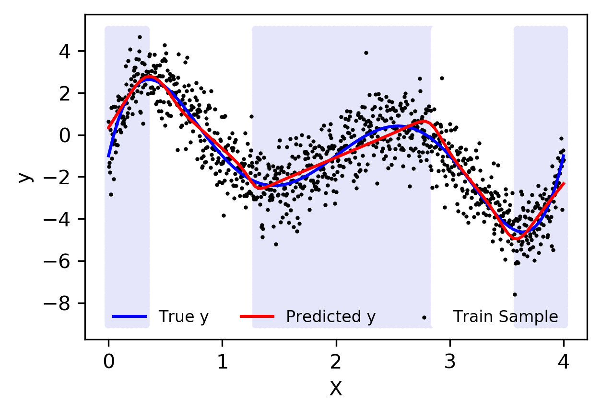
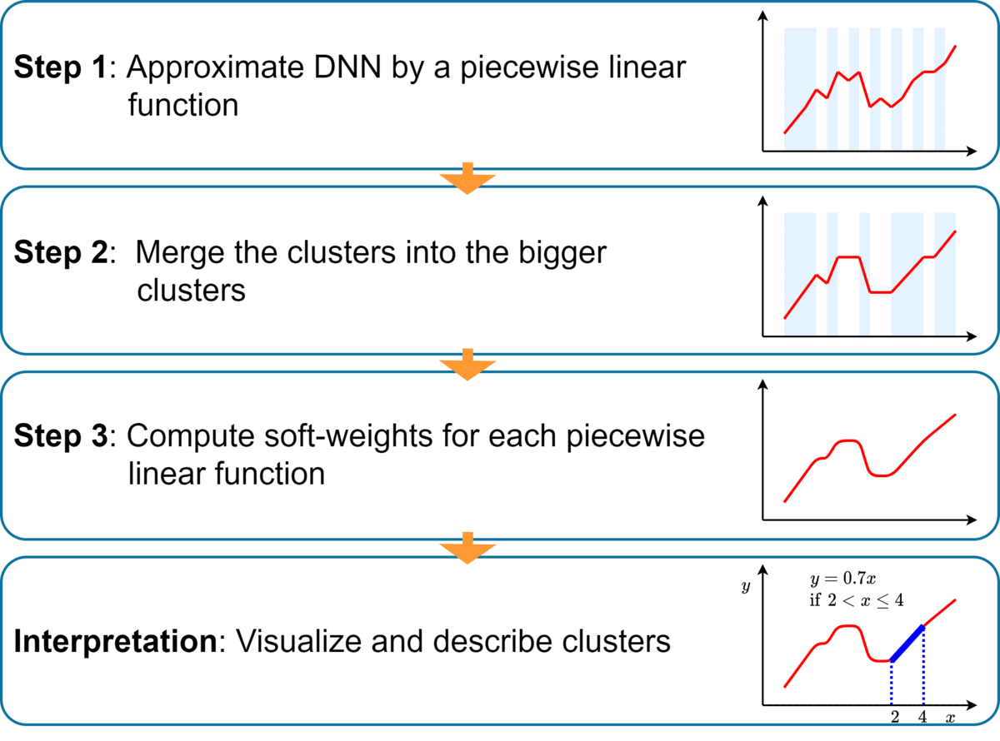
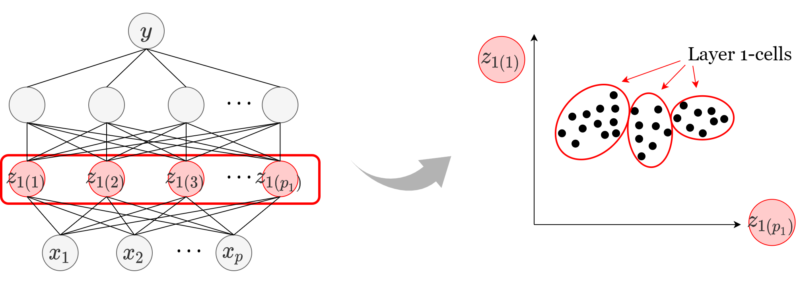
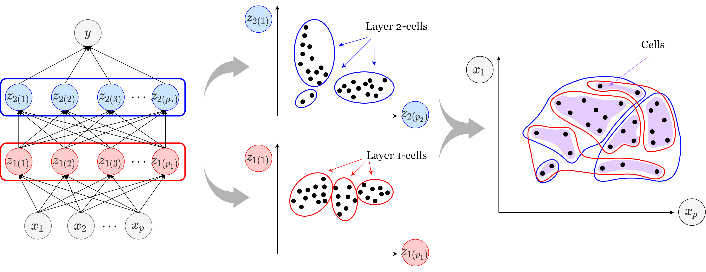
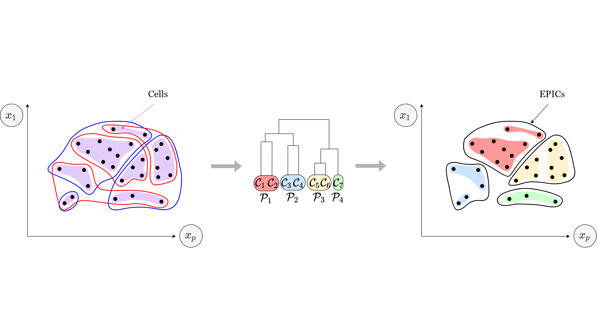
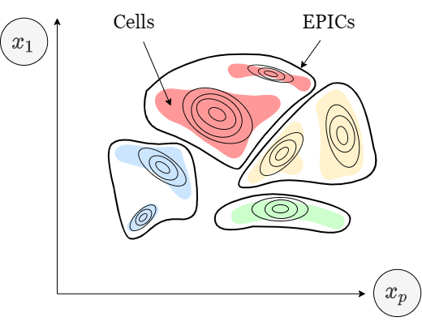

# Mixture of Linear Models(MLM)   Co-supervised by Deep Neural Network
<h4 class="author">Beomseok Seo</h4>
<h4 class="date">2022-05-01</h4>

MLM explains DNN by approximating it with a piecewise linear model.

<a href="https://arxiv.org/abs/2108.04035">Arxiv preprint can be obtained here.</a>

<h1 class="title toc-ignore">Overview</h1>

One natural idea of explaining a complex function is to view the function as a composite of multiple simple functions in different segments of input space.
 &rarr; How to find the segments?
 &rarr; Using DNN as a proxy of the optimal prediction function.

<h1 class="title toc-ignore">Construction of MLM</h1>

<h2>1. Express DNN as a piecewise linear function</h2>
          
          
          

          

<h2>2. Merge cells into EPIC</h2>
          
                    

                    

<h2>3. Apply softweights to MLM</h2>
          
